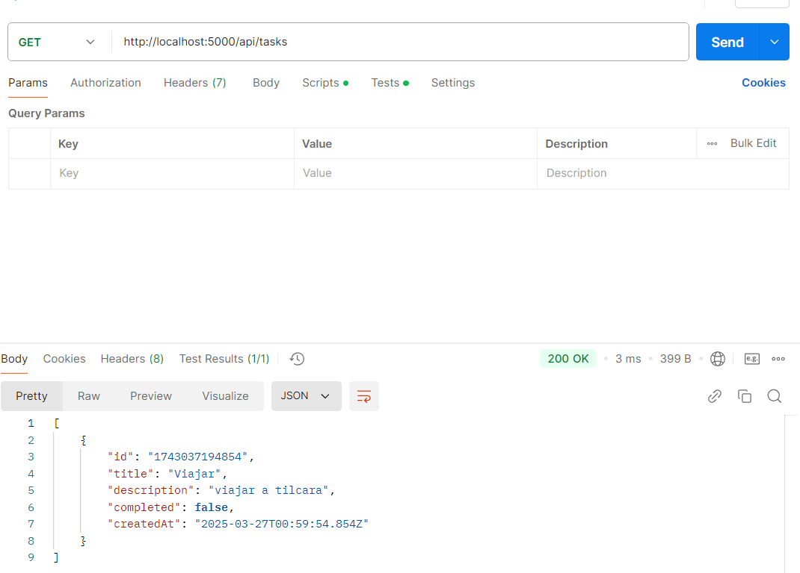
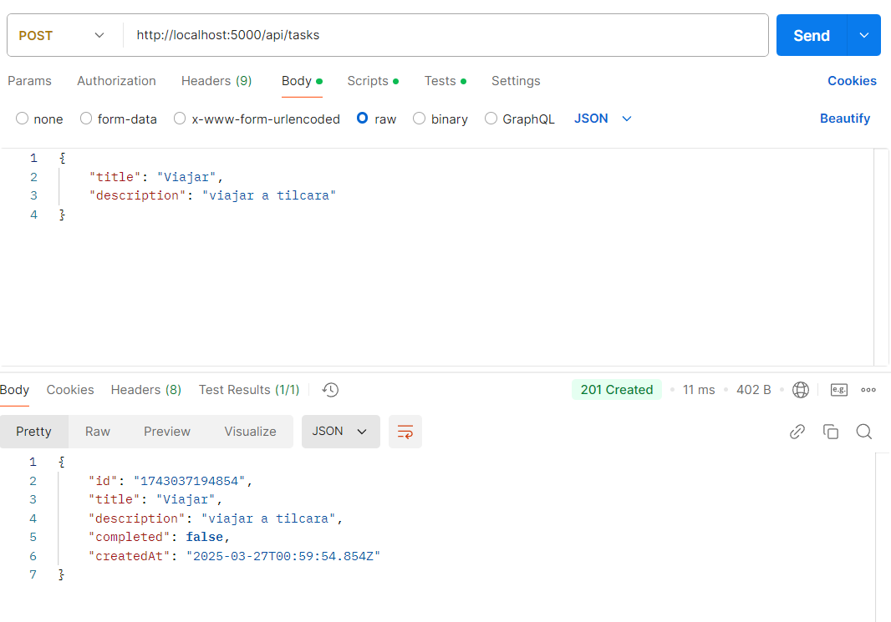
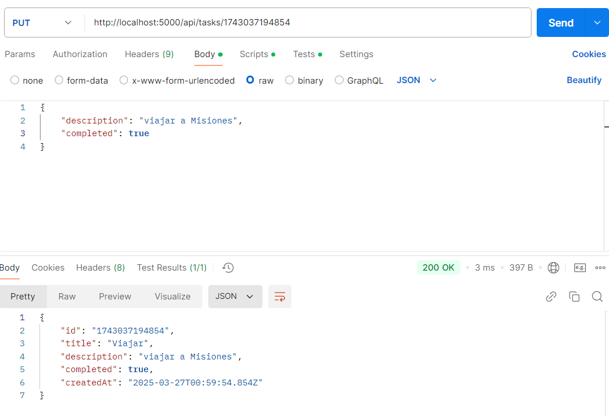
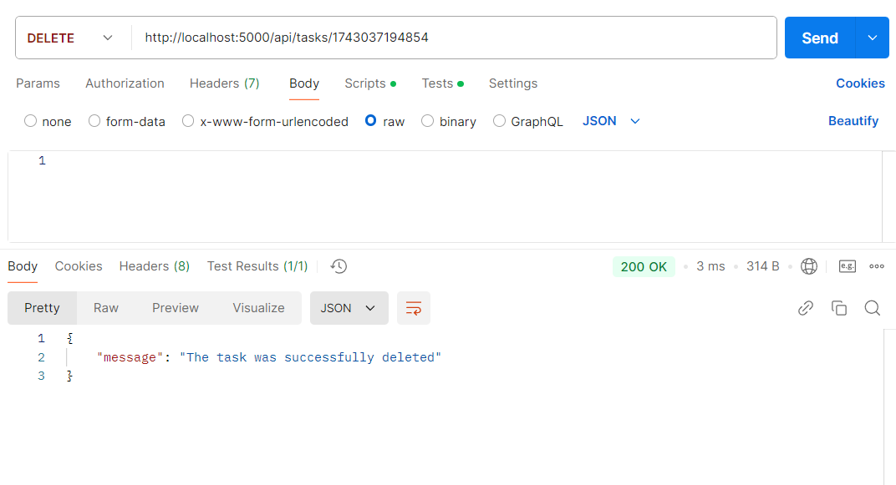
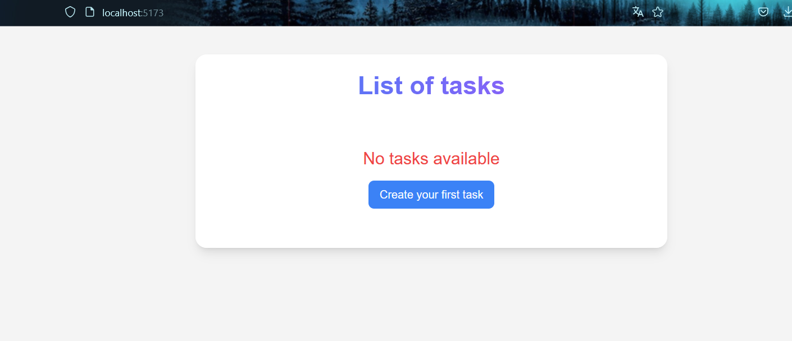
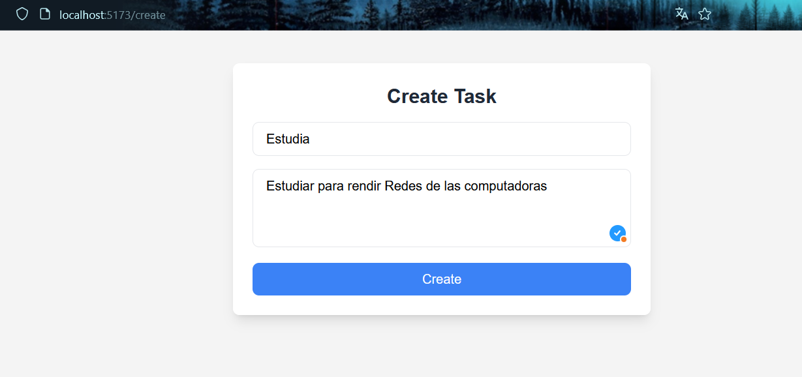
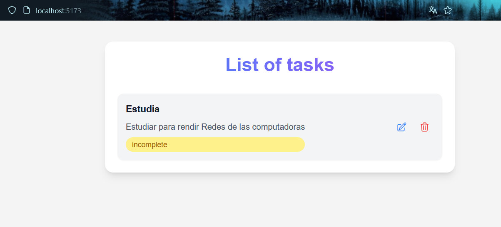
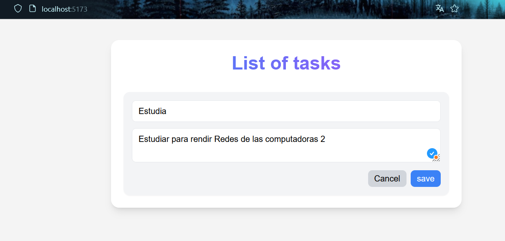
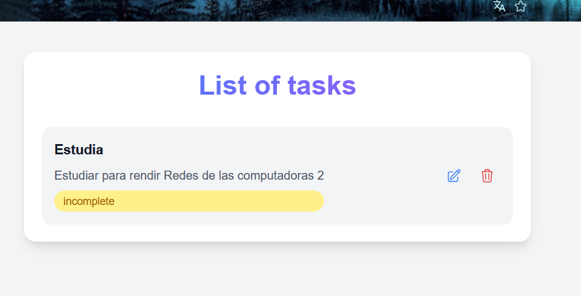

# 🚀 Challenge-forIT

<div align="center">
  
  <p><em>Aplicación de gestión de tareas fullstack</em></p>
</div>

## 📌 Tabla de Contenidos
- [Estructura del Proyecto](#-estructura-del-proyecto)
- [Requisitos](#-requisitos)
- [Instalación](#-instalación)
- [Configuración](#-configuración)
- [Tecnologías](#-tecnologías)
- [Capturas](#-capturas)
- [Endpoints API](#-endpoints-api)

## 🏗️ Estructura del Proyecto

```
challenge-forIT/
├── backend/                  # Servidor Node.js/Express
│   ├── controller/           # Controladores de lógica de negocio
│   │   └── taskController.js  
│   ├── models/               # Modelos de datos
│   │   └── taskModel.js      
│   ├── routes/               # Rutas API
│   │   └── taskRoutes.js     
│   ├── server.js             # Configuración de Express
│   └── index.js              # Punto de entrada del servidor
│
├── frontend/                 # Aplicación React (Vite)
│   ├── src/
│   │   ├── components/       # Componentes reutilizables
│   │   │   ├── TaskForm.jsx  # Formulario CRUD
│   │   │   ├── TaskList.jsx  # Lista de tareas
│   │   │   └── TaskItem.jsx  # Item individual
│   │   ├── pages/            # Páginas principales
│   │   │   ├── Home.jsx      
│   │   │   └── CreateTask.jsx
│   │   ├── App.jsx           # Definición de rutas
│   │   └── main.jsx          # Renderizado y configuración inicial
│   └── ...                   # Configuración de Vite y otros archivos
└── package.json              # Dependencias y configuración general
```

## 🛠️ Requisitos

- Node.js v16+
- npm v8+
- Git

## ⚡ Instalación

1. Clonar repositorio:
```bash
git clone https://github.com/MamaniMarioOrlando/challenge-forIT.git
cd challenge-forIT
```

2. Entrar en la carpeta del backend:
```bash
cd backend
```

3. Instalar dependencias:
```bash
npm install
```

4. Iniciar el servidor backend:
```bash
npm start
```

5. Entrar en la carpeta del frontend e instalar dependencias:
```bash
cd ../frontend/task-frontend
npm install
```

6. Iniciar la aplicación frontend:
```bash
npm run dev
```

## 🚀 Tecnologías

- **Backend**: Node.js, Express.js, MongoDB, JWT
- **Frontend**: React, Vite, TailwindCSS
- **Herramientas**: Git, Postman, Dotenv

## 🖼️ Capturas
### 📌 Backend con postman 


### 


### 


### 


### 📌 Frontend 


### 📌 Formulario creacion de  Tareas  


### 📌 Mostrar lista de tareas  


### 📌 Editar tarea 





## 📌 Endpoints API

| Método | Endpoint     | Descripción             |
|--------|------------|-------------------------|
| GET    | /api/tasks | Obtener todas las tareas |
| POST   | /api/tasks | Crear una nueva tarea    |
| PUT    | /api/tasks/:id | Actualizar una tarea |
| DELETE | /api/tasks/:id | Eliminar una tarea |


